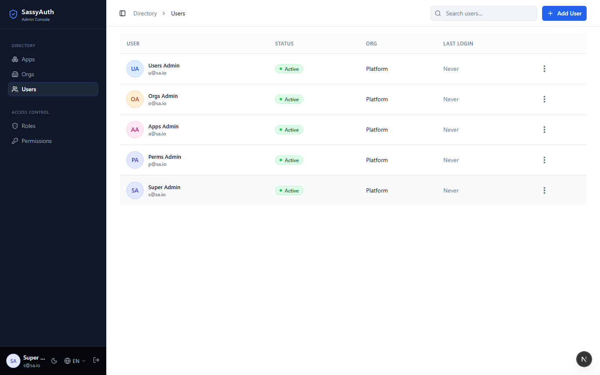
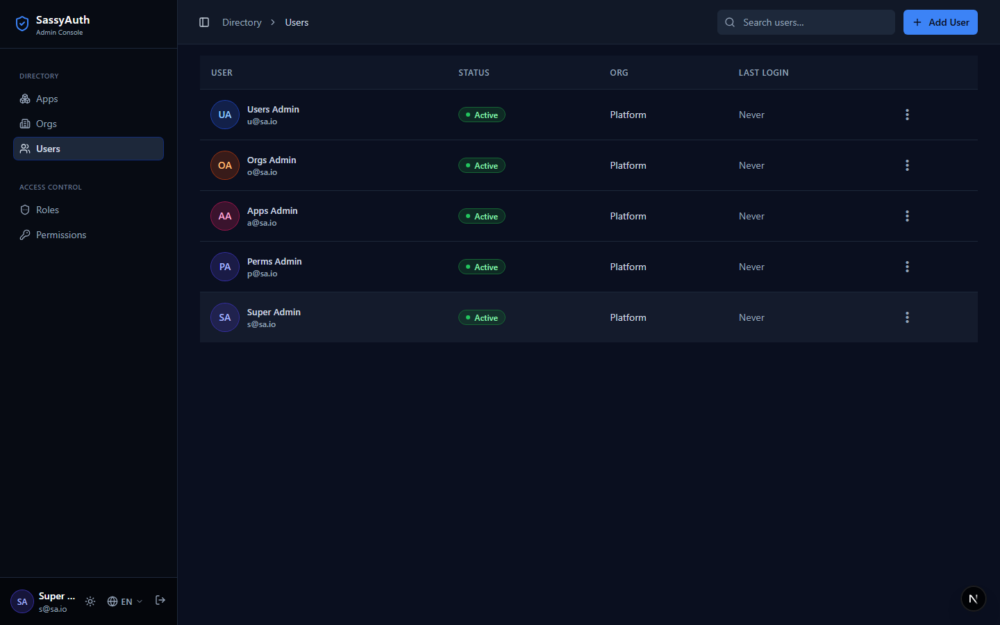

# SassyAuth

[](LICENSE)
[](SECURITY.md)
[](https://github.com/rlondner/sassy-auth/actions/workflows/e2e.yml)
[](https://github.com/rlondner/sassy-auth/actions/workflows/typecheck.yml)
[](https://github.com/rlondner/sassy-auth/actions/workflows/unit-tests.yml)
[](https://nodejs.org)
[](https://pnpm.io)
[](https://www.postgresql.org)

**A self-hosted, multitenant authentication and authorization server with a batteries-included admin console.** Your apps stop shipping their own login pages, session stores, and permission tables: they redirect to SassyAuth, receive an RS256 JWT carrying the user's org and effective permissions, and verify it independently against a JWKS endpoint.

It models four things — **apps**, **orgs**, **users**, and **permissions/roles** — so one deployment can serve several products, each with its own tenants, without any of them sharing a permission namespace or an admin UI.

## Who it's for

SassyAuth is built for **solo founders and small teams shipping SaaS** who have decided that identity is one part of the stack they would rather own than rent.

The hosted identity products are good, and renting is often the right call — this is not an argument that they are bad. It is an argument that the decision is worth making deliberately, because of three things that are easy to discover late:

- **The price follows your growth.** Per-MAU and per-tenant pricing means the bill arrives precisely when the business starts working. The terms you sign up under are also not the terms you are guaranteed to keep; pricing pages get rewritten, free tiers get narrowed, and you find out after you are already dependent.
- **The features multitenant SaaS actually needs tend to sit a tier up.** Organisations, SSO, and role management are common upgrade triggers — which means the moment your product grows into B2B is the moment your identity bill changes shape.
- **Leaving is the expensive part.** Identity is among the hardest dependencies to migrate off: password hashes you may not be able to export, live sessions, social account links, and every service that trusts the current token issuer. The switching cost is what makes the pricing power real.

So SassyAuth is deliberately built around a different set of defaults:

- **Self-hosted, on your Postgres.** User records, credentials, and sessions stay in a database you control. Nothing leaves it.
- **Apache-2.0, no paid tier, no per-user pricing.** There is no upgrade path to unlock organisations or roles, because they are the data model.
- **Nothing proprietary in the contract.** Tokens are ordinary RS256 JWTs verified against a standard JWKS endpoint, and the metadata is RFC 8414. Anything that speaks OAuth 2.0 can consume them, and a resource server written against SassyAuth is not written against SassyAuth specifically.
- **Small enough to own.** A few thousand readable lines. Owning infrastructure only beats renting it if you can actually read and fix the thing you own.
- **Batteries included.** Login, 2FA, invitations, password reset, email OTP, org-scoped RBAC, and an admin console to run it all — so "own your identity layer" does not turn into a quarter of building screens.

**Be clear-eyed about the trade.** Self-hosting means you carry the operational and security burden that a vendor would otherwise carry for you: patching, uptime, key rotation, and the consequences of getting it wrong. That is the actual price, and it is not zero. It is also why the status below matters, and why the [Known Limitations](#known-limitations) list is kept honest rather than short.

## Permissions that reach the API, not just the UI

Users now expect software that is personalized and feature-rich, and agentic features raise that bar again. That expectation has a structural cost: products grow tiers, plans, and personas, and each one sees a different subset of the application. What began as "logged in or not" becomes a matrix of who may see which screen and who may call which endpoint.

Most of that complexity is usually handled twice — once in the frontend to decide what to render, and again in the backend to decide what to allow — from two different sources of truth that drift apart. The drift is rarely visible, because the UI hides the button that the API would have refused anyway. It becomes visible the first time something calls the API without going through the UI at all.

**Which is exactly what agents do.** When a copilot, a background worker, or an MCP client acts on a user's behalf, it holds their token and calls your endpoints directly. There is no screen to hide a control on. Permission checks that live only in the frontend stop being a weak layer and start being no layer.

SassyAuth carries the user's effective permissions in the token itself:

```json
{
  "sub": "UkLW",
  "aud": "qp31",
  "org": "Xm4T",
  "iss": "https://auth.example.com",
  "scope": "reports.read reports.export billing.read",
  "amr": ["ext"],
  "idp": "google"
}
```

(`sub`, `aud`, and `org` are Sqid public IDs; `iat` and `exp` omitted here for brevity.)

The token has two shapes depending on how the user signed in. Password
sign-in carries `amr: ["pwd"]` and no `idp` claim at all. Federated (social)
sign-in carries `amr: ["ext"]` plus `idp` set to `"google"`, `"microsoft"`, or
`"apple"` — `ext` is a naming convention, not an RFC 8176 registered value
(the registry has no value meaning "federated"), and the provider name is
kept out of `amr` and given its own `idp` claim so a resource server can match
`amr` against one bounded, provider-independent set of values. Either shape
gets `otp` and `mfa` appended to `amr` when the user also completed
SassyAuth's own TOTP (see [Two-Factor Authentication](#two-factor-authentication-2fa)).

One RS256 JWT, verified against a JWKS endpoint, answers both questions from the same source: your API rejects the call, and your UI hides the control, using the same `scope` claim. No second round-trip to an authorization service on every request, and no permission table duplicated into your frontend.

> **Where this is honest today:** `scope` currently carries every permission the user holds, not only those belonging to the token's audience app. It is a superset, so an API that checks for the exact permission names it owns is correct — but a UI that renders from the raw claim will show entries meant for other apps. See [Known Limitations](#known-limitations) for the detail and the intended fix.

> ### ⚠️ Project status
>
> **Experimental — not security-audited, and not recommended for production use
> without your own review.**
>
> SassyAuth handles authentication, sessions, and token issuance, where defects
> are costly. It is published as useful and instructive work, not as a hardened
> product: there is no 1.0, no stability guarantee, and no upgrade path promised
> between commits.
>
> [**Known Limitations**](#known-limitations) is kept current and lists the gaps
> we already know about — read it before evaluating. To report a vulnerability,
> see [SECURITY.md](SECURITY.md).

---

## Screenshots

The admin console (Next.js 15 + Tailwind + Radix), light and dark:

| Light | Dark |
|-------|------|
|  |  |

---

## Quick Start (Docker)

Nothing to install but Docker:

```bash
git clone https://github.com/rlondner/sassy-auth.git
cd sassy-auth
docker compose up
```

First run takes a few minutes (it installs dependencies and builds the workspace). It generates an RS256 key pair and a BetterAuth secret onto a named volume, brings up PostgreSQL, applies migrations, and seeds platform data.

When it settles, open <http://localhost:3001/login> and sign in as `s@sa.io` / `Pass@word1234`.

| | |
|---|---|
| Admin console | <http://localhost:3001/login> |
| Auth server | <http://localhost:3000> |
| API docs (Swagger) | <http://localhost:3000/api/docs> |
| Mailpit — invitation + reset emails | <http://localhost:8025> |

Uncomment `SEED_DEMO` in `docker-compose.yml` to also seed the app, org, roles, and users the [FastAPI sample resource server](#sample-resource-server-fastapi) expects.

To rotate the generated keys, or start completely clean:

```bash
docker compose down -v      # -v also drops the database and the signing keys
```

> **This is a preview image, not a deployment artifact.** It runs the dev
> servers, runs both apps in one container, and runs with `NODE_ENV` unset —
> which is load-bearing rather than lazy: the session cookie's `Secure` flag is
> set from `NODE_ENV === 'production'`, and browsers do not store a Secure
> cookie sent over plain `http://localhost`, so a "production" container served
> over http could not be signed into at all. A real deployment needs compiled
> builds, TLS termination, separately scaled processes, a managed Postgres, and
> secrets that come from somewhere other than a volume on the host. No hardened
> image is provided — see [Known Limitations](#known-limitations).

## Quick Start (Flox)

If you have [Flox](https://flox.dev) installed, this is the whole thing — it provisions Node.js, pnpm, PostgreSQL, Python, and uv, writes a `.env.local` with freshly generated RSA keys, migrates the database, and seeds platform data:

```bash
git clone https://github.com/rlondner/sassy-auth.git
cd sassy-auth
flox activate
pnpm install
pnpm dev
```

Then open <http://localhost:3001/login> and sign in as `s@sa.io` / `Pass@word1234` (local dev default — see the [warning below](#5-seed-platform-data)).

Without Flox, follow [Getting Started](#getting-started) instead.

**Mint your first token**, once an app and a user exist:

```bash
curl -X POST http://localhost:3000/api/token/direct/login \
  -H "Content-Type: application/json" \
  -d '{"identifier":"user@example.com","password":"s3cr3t","appId":"<appPublicId>"}'
```

```json
{ "access_token": "<RS256 JWT>", "token_type": "Bearer", "expires_in": 3600 }
```

Verify it in your resource server against `http://localhost:3000/api/token/jwks` — see [JWKS and Token Verification](#jwks-and-token-verification), or run the [FastAPI sample](#sample-resource-server-fastapi) for a complete working consumer.

---

## What SassyAuth is not

Knowing the boundaries up front will save you an afternoon:

- **Not a certified OpenID Connect provider.** It is an OAuth 2.0 authorization server (it publishes RFC 8414 metadata), but there is no `id_token`, no `/userinfo` endpoint, and no OIDC certification. Consumers read identity from the JWT's `sub` / `org` / `aud` claims, or call `/api/me`.
- **No refresh tokens.** Access tokens live one hour and there is no refresh grant, no token introspection, and no revocation endpoint. Re-run the flow when a token expires.
- **No SAML, LDAP, or SCIM.** Social login is limited to the providers BetterAuth supports (Google, Microsoft, Apple, GitHub).
- **Not horizontally scalable as shipped.** Rate limiting keeps its counters in process, so each pod enforces its own budget. See [Known Limitations](#known-limitations).
- **Not a user-facing identity product.** There is no end-user self-service portal beyond `/account/security`; the console is built for operators and tenant admins.
- **Not audited.** See the project-status callout above.

## How it compares

Rough orientation, not a benchmark — pick the one whose trade-offs you want:

| | Trade-off |
|---|---|
| **Keycloak / Ory** | Far more complete and battle-tested (full OIDC, federation, SAML). Also far more surface area to run and reason about. SassyAuth is a few thousand lines you can read in an afternoon. |
| **Auth0 / Clerk / WorkOS** | Hosted, supported, and someone else's operational problem — a real advantage, and worth paying for if identity is not where you want to spend your attention. The trade is cost that scales with your user count, multitenant features that commonly sit in higher tiers, and a migration you would rather not have to do later. SassyAuth is yours to host and yours to patch: no per-MAU pricing, no data leaving your database, and no tier gating organisations or roles. |
| **BetterAuth on its own** | BetterAuth is the session and credential layer *inside* SassyAuth. Use it directly for a single app. SassyAuth adds the multitenant model (apps ↔ orgs ↔ users), the permission/role system, RS256 JWT issuance for external resource servers, and the admin console on top. |

## The name

**Sassy** is a light pun on **SaaS** — as in SaaS Authentication and Authorization, which is what it is for. No deeper meaning, and no relation to anything else called Sassy.

---

## Table of Contents

- [Who it's for](#who-its-for)
- [Permissions that reach the API, not just the UI](#permissions-that-reach-the-api-not-just-the-ui)
- [The name](#the-name)
- [Screenshots](#screenshots)
- [Quick Start (Docker)](#quick-start-docker)
- [Quick Start (Flox)](#quick-start-flox)
- [What SassyAuth is not](#what-sassyauth-is-not)
- [How it compares](#how-it-compares)
- [Prerequisites](#prerequisites)
- [Project Structure](#project-structure)
- [Getting Started](#getting-started)
- [RSA Key Pair Generation](#rsa-key-pair-generation)
- [Environment Variables](#environment-variables)
- [Auth Flows](#auth-flows)
- [JWKS and Token Verification](#jwks-and-token-verification)
- [Two-Factor Authentication (2FA)](#two-factor-authentication-2fa)
- [Social Sign-In](#social-sign-in)
- [API Reference](#api-reference)
- [Self-serve Registration](#self-serve-registration-post-apiregister)
- [Sample Resource Server (FastAPI)](#sample-resource-server-fastapi)
- [Admin Console](#admin-console)
- [Observability](#observability)
- [Running Tests](#running-tests)
- [Local email testing (Mailpit)](#local-email-testing-mailpit)
- [Known Limitations](#known-limitations)
- [Contributing](#contributing)
- [License](#license)

---

## Prerequisites

- Node.js >= 24
- pnpm >= 9
- PostgreSQL 14+

**Alternative: Flox (zero-config).** If you have [Flox](https://flox.dev) installed, run `flox activate` in the project root. It provisions Node.js, pnpm, PostgreSQL, Python, and uv automatically, generates `.env.local` with RSA keys and all required variables, runs database migrations, and seeds platform data. Skip to [step 6](#6-start-the-development-servers) after activation.

---

## Project Structure

Built as a Turborepo + pnpm monorepo. Two apps — `auth-server` (NestJS, port 3000) and `admin` (Next.js, port 3001) — plus a Python reference consumer, over three shared packages: `db` (Prisma), `types`, and `ui` (Tailwind + Radix design system).

<details>
<summary><strong>Full directory tree</strong></summary>

```
sassy-auth/
  apps/
    auth-server/             # NestJS (Express adapter) — main API (port 3000)
      src/
        auth/                # BetterAuth integration and guard
        token/               # JWT issuance: OAuth2 and direct login flows
        users/               # Users CRUD + role assignment
        invitations/         # Invitation issue / validate / accept
        orgs/                # Org CRUD
        roles/               # Role CRUD + permission assignment
        common/
          permissions/       # checkPermission helper
          middleware/        # RequestIdMiddleware
          logger/            # Winston + RequestLoggingMiddleware
          filters/           # SentryExceptionFilter, HttpExceptionFilter
          sqid/              # Sqid encoder service
        seed/                # Platform bootstrap script
        instrument.ts        # Sentry init (loaded BEFORE Nest bootstrap)
      test/                  # E2E tests
    admin/                   # Next.js 15 admin console (port 3001)
      app/
        login/               # /login page + Server Action
        accept-invite/       # /accept-invite token landing
        (admin)/             # Authenticated route group: /users, ...
        global-error.tsx     # Top-level error boundary (Sentry)
      components/            # admin-shell, user-create-drawer, ...
      lib/                   # api.ts (session-forwarding fetch wrappers)
      messages/              # i18n: en.json, fr.json
      sentry.{client,server,edge}.config.ts
      instrumentation.ts
      middleware.ts          # Edge auth gate
    resource-server-fastapi/  # Python/FastAPI reference resource server (port 8010)
      app/
        oauth/               # PKCE login flow + JWKS token verification
        api/                 # Protected API routes (/api/properties)
        web/                 # Public web routes
        templates/           # Jinja2 HTML templates
        static/              # CSS + JS
      tests/                 # pytest test suite
  packages/
    db/                      # Prisma schema, PrismaClient singleton, migrations
    types/                   # Shared TypeScript types (JWT payload, error codes, identifier detection)
    ui/                      # Shared design system: Button, Select, DataTable, Sheet, ...
  docs/                      # Design specs and plans
  designs/                   # Mockups
```

</details>

**Database tables:**

| Owner       | Tables                                                                                      |
|-------------|---------------------------------------------------------------------------------------------|
| BetterAuth  | `user`, `session`, `account`, `verification`                                                |
| SassyAuth   | `sa_app`, `sa_org`, `sa_user`, `sa_invitation`, `sa_permission`, `sa_role`, `sa_role_permission`, `sa_user_role`, `sa_user_permission`, `sa_oauth_code` |

`sa_user` links to BetterAuth's `user` table via the `betterAuthUserId` foreign key.

All external-facing IDs are Sqids (encoded from auto-increment integers). Database PKs are never exposed.

---

## Getting Started

### 1. Clone and install dependencies

```bash
git clone https://github.com/rlondner/sassy-auth.git
cd sassy-auth
pnpm install
```

### 2. Configure environment variables

The repo uses a **single `.env.local` at the repo root** (loaded by `dotenv-cli` for the Prisma scripts and by Next.js automatically). The `.env.example` file at the root is the source of truth.

```bash
cp .env.example .env.local
```

At minimum, set:

- `DATABASE_URL`
- `RSA_PRIVATE_KEY`, `RSA_PUBLIC_KEY` (see [RSA Key Pair Generation](#rsa-key-pair-generation))
- `BETTER_AUTH_SECRET` (32+ random chars)
- `BETTER_AUTH_URL` (e.g. `http://localhost:3000`)
- `ADMIN_URL` (e.g. `http://localhost:3001`) — used to build invitation URLs sent by the API
- `AUTH_SERVER_URL` (e.g. `http://localhost:3000`) — used by the admin Server Actions

See [Environment Variables](#environment-variables) for the full list.

### 3. Set up the database

Run migrations to create all tables:

```bash
pnpm --filter @sassy-auth/db db:migrate
```

### 4. Generate the Prisma client

```bash
pnpm --filter @sassy-auth/db db:generate
```

### 5. Seed platform data

```bash
pnpm --filter @sassy-auth/db db:seed
```

The seed script is idempotent — safe to run multiple times. It creates:

- The platform app (`isPlatform: true`, name "SassyAuth")
- The platform org (`isPlatform: true`, name "Platform")
- Platform permissions: `platform.orgs.manage`, `platform.apps.manage`, `platform.users.manage`, `platform.permissions.manage`, `platform.roles.manage`, `org.users.manage`, `org.roles.manage`
- System permissions (`isSystem: true`): `org.users.manage`, `org.roles.manage` — these bypass app-scope checks
- 5 platform admin users (`u@sa.io`, `o@sa.io`, `a@sa.io`, `p@sa.io`, `s@sa.io`), each with password `Pass@word1234`. `s@sa.io` is the super admin and is the recommended account for first sign-in.

> **The default password is for local development only.** It applies when
> `NODE_ENV` is `development` or `test`; anywhere else the seed refuses to run
> until you set `SEED_ADMIN_PASSWORD`. Never expose a deployment seeded with the
> default to a network you do not control.

**Optional — demo resource server data.** Set `SEED_DEMO=1` to additionally create a sample app (`resourceserver01`), an org (`Citadel`), 8 `rs.*` permissions, 2 roles, and 2 demo users (`m@cpm.io`, `i@cpm.io`) used by the [FastAPI sample resource server](apps/resource-server-fastapi/README.md).

**Optional — multi-tenant demo data.** Set `SEED_DEMO_MULTITENANT=1` to create a second sample app (`app01`) with two orgs (Acme, Globex), 3 users each, and org-scoped permissions (`contracts.read`, `contracts.create`, `org.users.manage`, `org.roles.manage`). Useful for testing the org-scoped admin experience.

### 6. Start the development servers

**All apps in parallel (recommended):**

```bash
pnpm dev          # turbo runs auth-server (3000) and admin (3001) together
```

**Or each app individually:**

```bash
pnpm --filter @sassy-auth/auth-server dev      # port 3000
pnpm --filter @sassy-auth/admin dev            # port 3001
```

Open <http://localhost:3001/login> to access the admin console.

---

## RSA Key Pair Generation

SassyAuth signs JWTs with RS256. Generate a 2048-bit RSA key pair and base64-encode both keys for use in the environment variables:

```bash
node -e "const c=require('crypto');const {privateKey,publicKey}=c.generateKeyPairSync('rsa',{modulusLength:2048});console.log('RSA_PRIVATE_KEY='+Buffer.from(privateKey.export({type:'pkcs8',format:'pem'})).toString('base64'));console.log('RSA_PUBLIC_KEY='+Buffer.from(publicKey.export({type:'spki',format:'pem'})).toString('base64'))"
```

Copy the two output lines directly into your `.env.local` file.

---

## Environment Variables

### Required

| Variable              | Description                                                    |
|-----------------------|----------------------------------------------------------------|
| `DATABASE_URL`        | PostgreSQL connection string                                   |
| `RSA_PRIVATE_KEY`     | Base64-encoded PKCS8 PEM private key (for signing JWTs)        |
| `RSA_PUBLIC_KEY`      | Base64-encoded SPKI PEM public key (served via JWKS endpoint)  |
| `JWT_KEY_ID`          | `kid` written into every issued JWT header and the JWKS document. Resource servers use it to pick the right key from the JWKS. Rotate together with the RSA key pair. Default: `sassy-auth-1` |
| `BETTER_AUTH_SECRET`  | Random string, 32+ characters                                  |
| `BETTER_AUTH_URL`     | Base URL of the auth server, e.g. `http://localhost:3000`. Also used as the JWT `iss` claim. |
| `TRUSTED_ORIGINS`     | Comma-separated list of origins allowed by BetterAuth CSRF. Default: `http://localhost:3001` |
| `SASSY_AUTH_ALLOW_INSECURE_APP_URLS` | Dev only. Set to `true` to allow registering apps whose `url` or `callbackUrl` uses `http` or a localhost/loopback host. Any other value (or unset) requires `https` with a public host. Default: unset (secure) |
| `SEED_ADMIN_PASSWORD` | Password given to every account created by the seed scripts. Falls back to `E2E_ADMIN_PASSWORD`, then to the documented dev default `Pass@word1234`. **Required when `NODE_ENV` is anything other than `development` or `test`** — the seed throws rather than provision admins with a publicly known password. |

<details>
<summary><strong>Admin console, observability, and social provider variables</strong></summary>

### Admin console

| Variable              | Description                                                                                |
|-----------------------|--------------------------------------------------------------------------------------------|
| `ADMIN_URL`           | Public URL of the admin console, used by the API to build invitation links. Default: `http://localhost:3001` |
| `AUTH_SERVER_URL`     | Internal URL the admin uses to reach the auth server. Default: `http://localhost:3000`      |
| `PUBLIC_AUTH_SERVER_URL` | Optional. URL of the auth server as seen by the BROWSER, used to build the social sign-in redirect on the login page. Defaults to `AUTH_SERVER_URL`. Set separately when `AUTH_SERVER_URL` is an internal address (e.g. a docker-network hostname) the browser cannot resolve. |
| `LOGIN_NEXT_ALLOWED_ORIGINS` | Comma-separated origins allowed by `/login?next=` redirect validation (in addition to `AUTH_SERVER_URL`). Default: empty |
| `SEED_DEMO`          | Set to `1` to seed demo data for the FastAPI resource server during `db:seed`. Default: unset |
| `SEED_DEMO_MULTITENANT` | Set to `1` to seed multi-tenant demo data (app01 + Acme/Globex orgs) during `db:seed`. Default: unset |
| `NEXT_PUBLIC_ADMIN_CONTACT_EMAIL` | Optional. Email address shown on the admin `/oauth-error` page's "Contact administrator" mailto. Leave unset to hide the link. The `NEXT_PUBLIC_` prefix is required so Next.js inlines it into the client bundle. |
| `PLATFORM_REQUIRE_2FA` | Set to exactly `true` to require 2FA for all platform operators. See [Two-Factor Authentication](#two-factor-authentication-2fa). Default: unset |

### Observability (optional)

Leave blank to disable. See [Observability](#observability) for behavior.

| Variable                    | Side  | Description                                                          |
|-----------------------------|-------|----------------------------------------------------------------------|
| `SENTRY_DSN`                | auth  | Sentry DSN for `auth-server` (server-side)                           |
| `SENTRY_ENVIRONMENT`        | both  | Override environment name (defaults to `NODE_ENV`)                   |
| `LOG_LEVEL`                 | auth  | `debug` \| `info` \| `warn` \| `error` (default: debug in dev, info in prod) |
| `NEXT_PUBLIC_SENTRY_DSN`    | admin | Sentry DSN for the admin browser bundle                              |
| `SENTRY_AUTH_TOKEN`         | admin | Build-time auth token for source-map upload                          |
| `SENTRY_ORG`                | admin | Sentry organization slug (build-time only)                           |
| `SENTRY_PROJECT`            | admin | Sentry project slug (build-time only)                                |

### Social providers (optional)

Omit the vars for any provider you do not want to enable — a provider is only
registered when every one of its required vars is set. Full setup steps
(provider console configuration, redirect URIs, Apple's paid-membership and
domain-verification requirements) are in
[`docs/social-auth-setup.md`](docs/social-auth-setup.md). See also
[Social Sign-In](#social-sign-in) for the invite-only behavior these
credentials gate.

| Variable                     | Description                |
|------------------------------|----------------------------|
| `GOOGLE_CLIENT_ID`           | Google OAuth client ID     |
| `GOOGLE_CLIENT_SECRET`       | Google OAuth client secret |
| `MICROSOFT_CLIENT_ID`        | Microsoft (Entra ID) OAuth client ID |
| `MICROSOFT_CLIENT_SECRET`    | Microsoft (Entra ID) OAuth client secret |
| `MICROSOFT_TENANT_ID`        | Optional. Pins Microsoft sign-in to a single Entra directory instead of `common`. See [`docs/social-auth-setup.md`](docs/social-auth-setup.md) for why this matters for email verification. |
| `APPLE_CLIENT_ID`            | Apple Services ID (Apple's OAuth `client_id` — not the App ID) |
| `APPLE_TEAM_ID`               | Apple Developer Team ID    |
| `APPLE_KEY_ID`                | Key ID of the Sign in with Apple `.p8` key |
| `APPLE_PRIVATE_KEY`           | Contents of the `.p8` private key. There is no `APPLE_CLIENT_SECRET`: Apple's client secret is a short-lived JWT generated at runtime from these three vars, not a static value. |
| `GITHUB_CLIENT_ID`           | GitHub OAuth client ID     |
| `GITHUB_CLIENT_SECRET`       | GitHub OAuth client secret |
| `E2E_STUB_IDP_URL`            | **Non-production only.** URL of the stub OIDC provider used by the e2e suite. Only registers when `NODE_ENV` is exactly `test` or `development` — never set this in production, the stub is a full authentication bypass if reachable. |
| `SQIDS_ALPHABET`             | Custom alphabet for Sqids encoding; leave blank for default |

</details>

---

## Auth Flows

### Flow A: OAuth2 Authorization Code with PKCE (S256)

Use this flow for third-party or external resource servers that redirect users to SassyAuth for login. PKCE is **required** — only the `S256` method is accepted, and the server rejects authorize requests that arrive without a code challenge.

**Step 1 — Generate a PKCE verifier and challenge (client-side)**

```javascript
const crypto = require('crypto');

const verifier = crypto.randomBytes(64).toString('base64url'); // 43-128 chars
const challenge = crypto.createHash('sha256').update(verifier).digest('base64url');
// Keep `verifier` server-side. Send `challenge` on the authorize call.
```

**Step 2 — Redirect the user to the authorization endpoint**

```
GET /api/token/oauth/authorize
  ?client_id=<appPublicId>
  &redirect_uri=<uri>
  &code_challenge=<S256 challenge>
  &code_challenge_method=S256
  &state=<state>
```

The user authenticates using any method BetterAuth supports: email/password, magic link, email OTP, or a configured social provider (Google, Microsoft, Apple, GitHub).

**Step 3 — Receive the authorization code**

After successful authentication, SassyAuth validates that the user's org is associated with the requested app and that the `redirect_uri` is allowed for that app, then redirects to:

```
<redirect_uri>?code=<code>&state=<state>
```

How the `redirect_uri` is validated depends on the app's `sa_app` row:

- **Default (no `callbackUrl` set):** the `redirect_uri` must share an origin (scheme + host + port) with the app's registered `url`. Any path under that origin is accepted.
- **With `callbackUrl` set:** the `redirect_uri` must equal the configured `callbackUrl` exactly. A trailing-slash difference is tolerated; scheme, host, port, path, and query string must otherwise match.

A `redirect_uri` that doesn't satisfy the applicable rule returns `400 invalid_redirect_uri`. Note that registering an app whose `url` or `callbackUrl` uses `http` or a `localhost`/loopback host requires the auth server to run with `SASSY_AUTH_ALLOW_INSECURE_APP_URLS=true`; by default both must be `https` with a public host (see [Environment Variables](#environment-variables)).

**Step 4 — Exchange the code + verifier for a JWT**

```bash
curl -X POST http://localhost:3000/api/token/oauth/token \
  -H "Content-Type: application/json" \
  -d '{
    "code": "<authorization-code>",
    "client_id": "<appPublicId>",
    "code_verifier": "<verifier>",
    "redirect_uri": "<redirect_uri>"
  }'
```

Response:

```json
{
  "access_token": "<RS256 JWT>",
  "token_type": "Bearer",
  "expires_in": 3600
}
```

> **Note:** The `redirect_uri` sent here must match the one validated at the authorize step — by origin against the app's `url`, or exactly against the app's `callbackUrl` when one is configured.

Authorization codes are single-use and stored in the database (`SaOauthCode` table). The verifier must match the challenge sent in Step 2 byte-for-byte after S256 hashing.

### Flow B: Direct Login

Use this flow for first-party apps and management UIs that collect credentials directly without a browser redirect.

```bash
curl -X POST http://localhost:3000/api/token/direct/login \
  -H "Content-Type: application/json" \
  -d '{
    "identifier": "user@example.com",
    "password": "s3cr3t",
    "appId": "<appPublicId>"
  }'
```

The `identifier` field is auto-detected and accepts:

- Email address — `user@example.com`
- Phone number — `+15551234567`
- Username — `johndoe`

The password is validated against the scrypt hash stored by BetterAuth (format `<saltHex>:<hashHex>`). No BetterAuth session is created; only a JWT is returned.

Response:

```json
{
  "access_token": "<RS256 JWT>",
  "token_type": "Bearer",
  "expires_in": 3600
}
```

### Flow C: Invite + Accept

An admin (or platform operator) creates a user and emails them an invitation URL. The user clicks through, sets a password, and is activated.

```text
POST /api/users                 → admin creates user; response includes inviteUrl
GET  /api/invitations/:token    → admin console reads invite to render the welcome screen
POST /api/invitations/:token    → user submits password; creates BetterAuth account, marks invitation used
POST /api/users/:id/resend-invitation  → admin reissues invitation for a pending user
```

Invitations expire after 7 days. See `apps/auth-server/src/invitations/` and `apps/admin/app/accept-invite/`.

---

## JWKS and Token Verification

Resource servers must never trust JWTs blindly. Verify the signature using the public key served from SassyAuth's JWKS endpoint.

**Fetch the JWKS document:**

```bash
curl http://localhost:3000/api/token/jwks
```

```json
{
  "keys": [
    {
      "kty": "RSA",
      "use": "sig",
      "alg": "RS256",
      "kid": "...",
      "n": "...",
      "e": "AQAB"
    }
  ]
}
```

**JWT header:**

| Field          | Description                                        |
|----------------|----------------------------------------------------|
| `alg`          | `RS256`                                            |
| `typ`          | `JWT`                                              |
| `kid`          | Matches the `kid` of the key in the JWKS document. Controlled by `JWT_KEY_ID`. |

**JWT payload structure:**

| Claim          | Description                                                                   |
|----------------|-------------------------------------------------------------------------------|
| `sub`          | User public ID (Sqid)                                                         |
| `aud`          | App public ID (Sqid)                                                          |
| `org`          | Org public ID (Sqid)                                                          |
| `iss`          | Value of `BETTER_AUTH_URL` at issuance time                                   |
| `scope`        | Space-separated list of effective permission names (OAuth 2.0 `scope` claim)  |
| `amr`          | Authentication methods — see [2FA](#two-factor-authentication-2fa)             |
| `idp`          | Identity provider for a federated sign-in — `google`, `microsoft`, or `apple`. Present only when `amr` includes `ext`; absent for password sign-in. See [Social Sign-In](#social-sign-in). |
| `iat`          | Issued at (Unix timestamp)                                                    |
| `exp`          | Expiry — 1 hour after issuance                                                |

**Example verification in Node.js:**

```javascript
const jwksClient = require('jwks-rsa');
const jwt = require('jsonwebtoken');

const client = jwksClient({
  jwksUri: 'http://localhost:3000/api/token/jwks',
});

function getKey(header, callback) {
  client.getSigningKey(header.kid, (err, key) => {
    callback(err, key?.getPublicKey());
  });
}

jwt.verify(
  token,
  getKey,
  {
    algorithms: ['RS256'],
    issuer: process.env.BETTER_AUTH_URL,
    audience: '<your-app-publicId>',
  },
  (err, decoded) => {
    if (err) throw err;
    // decoded.sub   — user public ID
    // decoded.aud   — app public ID
    // decoded.org   — org public ID
    // decoded.scope — space-separated permission names, e.g. "rs.properties.read rs.inspections.read"
    const scopes = new Set(String(decoded.scope ?? '').split(' '));
    if (!scopes.has('rs.properties.read')) throw new Error('insufficient_scope');
  },
);
```

A Python/FastAPI example using `pyjwt[crypto]` and `PyJWKClient` is in [`apps/resource-server-fastapi/`](apps/resource-server-fastapi/README.md).

Cache the JWKS document locally and refresh it only when you encounter a `kid` you do not recognise. Do not fetch it on every request.

> ⚠️ Read the [`scope` claim limitation](#known-limitations) before you write authorization logic against it: today it lists *every* permission the user holds, not only those belonging to the token's audience.

---

## Two-Factor Authentication (2FA)

SassyAuth supports optional two-factor authentication on a per-app basis. Users can enable 2FA for their account via the admin console (`/account/security`), and each application can require it for its users.

**Per-app enforcement:** Non-platform apps can set the `requireTwoFactor` flag when creating or editing an app in the admin console. When enabled, users must complete a 2FA challenge (TOTP) during login to that app.

**Platform app enforcement:** The platform admin app (immutable via UI) requires 2FA via the `PLATFORM_REQUIRE_2FA` environment variable. Set it to exactly `"true"` to enforce 2FA for all platform operators. If enforcement locks you out, use the admin "Reset 2FA" action to recover.

**JWT authentication methods:** When a JWT is issued, it includes an `amr` (Authentication Methods) claim:

- `["pwd"]` — password authentication only (2FA not satisfied)
- `["pwd","otp","mfa"]` — password + TOTP one-time password (2FA satisfied)

Resource servers can inspect the `amr` claim to gate sensitive operations.

---

## Social Sign-In

Users can sign in with Google, Microsoft, or Apple in addition to a password.
Setup steps (provider console configuration, env vars) are in
[`docs/social-auth-setup.md`](docs/social-auth-setup.md); this section covers
the behavior.

**Invite-only — not a signup method.** Social sign-in only ever *links* to an
existing, active `SaUser`; it never creates one. A user must already have been
provisioned (by an admin, or via an accepted invitation) before their first
"Sign in with Google/Microsoft/Apple" click will work. An unrecognised
identity is refused, with no `User`, `SaUser`, or org row created as a side
effect. First sign-in matches on `(providerId, sub)` if a link already exists,
and otherwise on an email address the provider asserts is verified.
Just-in-time provisioning and domain-claimed orgs (an org auto-admitting users
whose email domain matches) are both deliberately out of scope — see
[Known Limitations](#known-limitations).

**Credentials are deployment-global.** One `clientId`/`clientSecret` pair per
provider is configured for the whole deployment via environment variables;
individual apps opt a configured provider's button in or out, but cannot
bring their own OAuth client. See
[`docs/social-auth-setup.md`](docs/social-auth-setup.md).

**Token contract.** A federated sign-in's JWT carries `amr: ["ext"]` and an
`idp` claim naming the provider (`"google"` | `"microsoft"` | `"apple"`);
`otp`/`mfa` are appended to `amr` exactly as with password sign-in when the
user also completes SassyAuth's own TOTP. See
[JWKS and Token Verification](#jwks-and-token-verification) for the full
claim table. Social sign-in never satisfies or bypasses an app's
`requireTwoFactor` setting — a federated user with a 2FA-required app still
has to enroll in and complete SassyAuth's own TOTP.

**Two things worth knowing before you rely on this:**

- A user whose `SaUser` exists but is not `active` gets a bare `403` response
  instead of the friendly `/oauth-error` page. BetterAuth's session-creation
  gate freezes the response status before the hook that would redirect to
  `/oauth-error` can run. The refusal is still recorded in the audit trail
  (`SaAuditEvent`); only the user-facing presentation is affected.
- Apple's "Hide My Email" relay addresses (`@privaterelay.appleid.com`) *are*
  detected — via Apple's own `is_private_email` claim, not domain
  pattern-matching — and the user is shown a specific message telling them to
  choose "Share My Email" on Apple's consent screen instead. This works
  correctly; it is not a limitation.

**Provider discovery.** `GET /api/social-providers?client_id=<appPublicId>`
returns the list of provider buttons that app's login page should render.
It is public and unauthenticated by design — it discloses only which buttons
to show, never credentials — and returns an empty list (not a 404) for an
unknown `client_id`, so it cannot be used to enumerate registered apps.

---

## API Reference

The endpoints you will use from a resource server:

| Method | Path                                          | Description                                      |
|--------|-----------------------------------------------|--------------------------------------------------|
| GET    | `/.well-known/oauth-authorization-server`     | RFC 8414 OAuth AS metadata (issuer, endpoints, supported methods) |
| GET    | `/api/token/jwks`                             | JWKS document with RS256 public key              |
| GET    | `/api/token/oauth/authorize`                  | OAuth2 authorization — initiates login flow      |
| POST   | `/api/token/oauth/token`                      | Exchange authorization code for JWT              |
| POST   | `/api/token/direct/login`                     | Direct credential login — returns JWT            |
| GET    | `/api/me`                                     | Caller's profile: org, app context, effective permissions |
| POST   | `/api/register`                               | **Self-serve signup** — atomically create org + user + org↔app association ([details](#self-serve-registration-post-apiregister)) |
| GET    | `/api/social-providers`                       | **Public.** Which social sign-in buttons an app's login page should render ([details](#social-sign-in)) |
| PUT    | `/api/social-providers/{clientId}`            | Set an app's enabled social providers (`platform.apps.manage`)  |
| ALL    | `/api/auth/*`                                 | BetterAuth: sign-up, sign-in, magic link, OTP, social login |

<details>
<summary><strong>Full management API (users, orgs, apps, roles, permissions, invitations)</strong></summary>

| Method | Path                                          | Description                                      |
|--------|-----------------------------------------------|--------------------------------------------------|
| GET    | `/api/users`                                  | List users (filter by `orgId`, `appId`)          |
| GET    | `/api/users/:id`                              | Get user                                         |
| POST   | `/api/users`                                  | Create user + invitation                         |
| PATCH  | `/api/users/:id`                              | Update user                                      |
| DELETE | `/api/users/:id`                              | Delete user                                      |
| GET    | `/api/users/:id/roles`                        | List user's roles                                |
| PUT    | `/api/users/:id/roles`                        | Set-replace all roles (atomic swap)              |
| POST   | `/api/users/:id/roles`                        | Assign role                                      |
| DELETE | `/api/users/:id/roles/:roleId`                | Remove role                                      |
| GET    | `/api/users/:id/direct-permissions`           | List user's direct permission assignments        |
| PUT    | `/api/users/:id/direct-permissions`           | Set-replace all direct permissions (atomic swap) |
| GET    | `/api/users/:id/effective-permissions`        | Computed permissions (roles ∪ direct)            |
| POST   | `/api/users/:id/resend-invitation`            | Re-issue invitation for a pending user           |
| GET    | `/api/invitations/:token`                     | Validate an invitation (returns user info + `expired`) |
| POST   | `/api/invitations/:token`                     | Accept invitation (sets password, creates Account, activates user) |
| GET    | `/api/orgs`                                   | List orgs (filter by `appId`)                    |
| GET    | `/api/orgs/:id`                               | Get org                                          |
| POST   | `/api/orgs`                                   | Create org                                       |
| PATCH  | `/api/orgs/:id`                               | Update org                                       |
| DELETE | `/api/orgs/:id`                               | Delete org                                       |
| GET    | `/api/apps`                                   | List apps (filter by `orgId`)                    |
| GET    | `/api/apps/:id`                               | Get app                                          |
| POST   | `/api/apps`                                   | Create app                                       |
| PATCH  | `/api/apps/:id`                               | Update app                                       |
| DELETE | `/api/apps/:id`                               | Delete app                                       |
| GET    | `/api/roles`                                  | List roles (filter by `appId`)                   |
| GET    | `/api/roles/:id`                              | Get role (includes permissions, user count)       |
| POST   | `/api/roles`                                  | Create role with permission IDs                  |
| PATCH  | `/api/roles/:id`                              | Update role name/description/permissions         |
| DELETE | `/api/roles/:id`                              | Delete role (blocked if users assigned)          |
| GET    | `/api/permissions`                            | List permissions (filter by `appId`, search `q`) |
| GET    | `/api/permissions/:id`                        | Get permission (includes role/user detail)       |
| POST   | `/api/permissions`                            | Create permission                                |
| PATCH  | `/api/permissions/:id`                        | Update permission name/description               |
| DELETE | `/api/permissions/:id`                        | Delete permission (blocked if roles/users assigned) |

</details>

BetterAuth mounts on Express before NestJS and intercepts all `/api/auth/*` routes directly. NestJS handles all other routes.

Full OpenAPI spec is in `docs/`.

---

## Self-serve Registration (`POST /api/register`)

A public endpoint for resource-server-driven customer signup. It atomically creates an org, a BetterAuth user, and the org↔app association in a single transaction.

### Request

```json
POST /api/register
Content-Type: application/json

{
  "email":       "user@example.com",
  "password":    "s3cr3tP@ss",
  "companyName": "Acme Corp",
  "appPublicId": "<sa_app.publicId>"
}
```

| Field         | Type   | Rules                    |
|---------------|--------|--------------------------|
| `email`       | string | valid email              |
| `password`    | string | min 8 characters         |
| `companyName` | string | min 1 character          |
| `appPublicId` | string | must match an existing app |

### Responses

| Status | Meaning                                     |
|--------|---------------------------------------------|
| `201`  | `{ "ok": true }` — org + user created       |
| `400`  | Validation error (missing/invalid fields)   |
| `404`  | Unknown `appPublicId`                       |
| `409`  | Email already registered                    |
| `429`  | Rate limit exceeded (see below)             |

### Rate limiting

The endpoint is guarded by an in-memory per-IP fixed-window rate limiter. Configure it via env vars:

| Variable                 | Description                                                              | Default      |
|--------------------------|--------------------------------------------------------------------------|--------------|
| `REGISTER_RATE_LIMIT`    | Max requests per IP per window. `0` or unset = unlimited (dev/trusted)  | `10`         |
| `REGISTER_RATE_WINDOW_MS`| Window length in milliseconds                                            | `3600000` (1 h) |

> **Multi-instance note:** the rate-limit store is in-process. In a horizontally-scaled deployment (multiple pods / workers), each instance maintains its own counter. For consistent enforcement across pods, replace the in-memory store with a shared backend such as Redis.

---

## Sample Resource Server (FastAPI)

A runnable Python/FastAPI sample lives at [`apps/resource-server-fastapi/`](apps/resource-server-fastapi/README.md). It demonstrates the full Flow A (PKCE) round-trip from a non-Node consumer: starting the authorize redirect, exchanging the code, verifying the JWT against the JWKS endpoint, and scope-gating a protected endpoint.

The sample relies on the `SEED_DEMO=1` data (`resourceserver01` app, `Citadel` org, demo users `m@cpm.io` / `i@cpm.io`). The RS app's own README walks through both the seed-driven setup and a manual admin-UI alternative for users who want to provision everything from scratch.

**Prerequisites:** Python 3.11+, pip or uv.

```bash
cd apps/resource-server-fastapi
python -m venv .venv && source .venv/bin/activate  # or .venv\Scripts\activate on Windows
pip install -e ".[dev]"
cp .env.example .env
# Edit .env — set SASSY_CLIENT_ID to the app's publicId from the seed
uvicorn app.main:app --port 8010 --reload
```

| Variable              | Description                                                   |
|-----------------------|---------------------------------------------------------------|
| `AUTH_SERVER_URL`     | SassyAuth base URL (default `http://localhost:3000`)          |
| `ADMIN_URL`           | Admin console URL for login redirect (default `http://localhost:3001`) |
| `SASSY_CLIENT_ID`     | `sa_app.publicId` for this resource server (from seed output) |
| `RS_BASE_URL`         | Public URL of this server (e.g. `http://localhost:8010`)      |
| `REDIRECT_URI`        | OAuth callback URL (e.g. `http://localhost:8010/auth/callback`) |

Routes:

- `/` — landing page with login button
- `/auth/login` — initiates PKCE flow → redirects to SassyAuth
- `/auth/callback` — receives authorization code, exchanges for JWT
- `/api/properties` — protected endpoint; requires Bearer token with `rs.properties.read` scope

Run its test suite with `pytest`.

---

## Admin Console

The admin console is a Next.js 15 app at `apps/admin/` listening on **port 3001**.

```bash
pnpm --filter @sassy-auth/admin dev
```

Routes:

- `/login` — credential login (proxies BetterAuth via Server Action)
- `/accept-invite?token=...` — invitation landing
- `/oauth-error` — OAuth error page (shown when the authorize flow fails; optionally links to `NEXT_PUBLIC_ADMIN_CONTACT_EMAIL`)
- `/users` — users management (TanStack Table, view/edit/create drawers)
- `/orgs` — org management
- `/apps` — app management
- `/roles` — role management with inline permission assignment
- `/permissions` — permission management with role/user detail view
- `/account/security` — per-user 2FA enrolment

All CRUD operations (create, update, delete) show success toast notifications via [Sonner](https://sonner.emilkowal.dev/). The `<Toaster />` is mounted in the root layout and respects the user's light/dark theme preference.

i18n is wired with `next-intl` (locales: `en`, `fr`). Strings live in `apps/admin/messages/`. The active locale is detected from the `Accept-Language` header and can be overridden via the `LocaleSwitcher` in the shell.

The admin console talks to `auth-server` via `AUTH_SERVER_URL` (default `http://localhost:3000`). All API calls forward the BetterAuth session cookie via the helpers in `apps/admin/lib/api.ts`.

The login page supports a `next=<url>` query parameter for post-login redirect (e.g., from a resource server's OAuth flow). URLs are validated against an allowlist (`AUTH_SERVER_URL` + `LOGIN_NEXT_ALLOWED_ORIGINS` env var) to prevent open redirects.

---

## Observability

Both apps integrate **Winston** (structured logging) and **Sentry** (error tracking). To enable Sentry, set the `SENTRY_*` env vars (see [Observability env vars](#environment-variables)). With `SENTRY_DSN` blank, both apps skip Sentry init and continue running.

<details>
<summary><strong>How it is wired</strong></summary>

**Auth server (`apps/auth-server`):**

- `instrument.ts` initializes Sentry **before** Nest bootstraps so OTel auto-instrumentation can attach.
- `LoggerService` wraps Winston with NestJS's `LoggerService` interface; console transport in all envs; dev adds a file transport.
- `RequestIdMiddleware` propagates or generates `X-Request-Id` per request.
- `RequestLoggingMiddleware` emits one structured line per request: method, URL, status, duration, request-id.
- `SentryExceptionFilter` forwards 5xx errors to Sentry; 4xx are logged but not reported.

**Admin (`apps/admin`):**

- `sentry.client.config.ts`, `sentry.server.config.ts`, `sentry.edge.config.ts` — runtime SDK setup.
- `instrumentation.ts` — Next.js instrumentation hook.
- `app/global-error.tsx` — top-level error boundary that calls `Sentry.captureException`.
- `app/(admin)/error.tsx` — admin route group error boundary.
- Breadcrumbs are added on login attempts (success/failure) and on critical admin actions.

</details>

> ⚠️ **Known issue (bug-0002):** invitation tokens currently appear verbatim in `RequestLoggingMiddleware` log lines (they are path segments). Do not point a production log shipper at this code until the request-URL scrubber is in place. See `BUGs.md`.

> ⚠️ **Known issue (bug-0004):** plaintext emails are sent to Sentry via `Sentry.setUser({ email })` and to Winston in the `User created` log. Strip / hash before any GDPR-bound deployment.

---

## Running Tests

### Unit tests

```bash
pnpm test                                       # all packages (turbo)
pnpm --filter @sassy-auth/auth-server test
pnpm --filter @sassy-auth/admin test
pnpm --filter @sassy-auth/ui test
```

Unit test files live alongside source files as `*.spec.ts` / `*.test.tsx` and run with Jest. The BetterAuth node adapter and `uuid` are mocked in `apps/auth-server/src/__mocks__/`.

### E2E tests

**Auth-server E2E (Jest + Supertest):**

```bash
pnpm --filter @sassy-auth/auth-server test:e2e
```

Tests are in `apps/auth-server/test/` using the Jest config at `test/jest-e2e.json`. They require a running database.

**Admin E2E (Playwright):**

```bash
# Requires both servers running (pnpm dev in another terminal)
pnpm --filter @sassy-auth/admin-e2e test:e2e

# Headed mode (see the browser)
pnpm --filter @sassy-auth/admin-e2e test:e2e:headed

# Interactive UI mode
pnpm --filter @sassy-auth/admin-e2e test:e2e:ui
```

Tests are in `apps/admin-e2e/tests/`. In CI, the Playwright config automatically starts both servers. Locally, start `pnpm dev` first. See `apps/admin-e2e/README.md` for details.

---

## Local email testing (Mailpit)

By default the auth-server uses a **console** email transport (logs the message, sends nothing) — no setup needed for dev or CI.

To view real emails locally, run [Mailpit](https://mailpit.axllent.org/):

```bash
docker compose -f docker-compose.dev.yml up -d
```

Then in `.env.local` set:

```bash
EMAIL_SMTP_HOST=localhost
EMAIL_SMTP_PORT=1025
```

Sent emails appear at <http://localhost:8025>. For production, set `RESEND_API_KEY` instead (takes precedence over SMTP).

---

## Known Limitations

The following items are deferred to later sub-projects and are not yet production-ready. See [`docs/history/`](docs/history/) for the full bug catalog, daily follow-up lists, and the design docs behind each feature.

**JWT `scope` claim lists every permission the user holds, not just the ones for the app the token was issued to.**

When a token is issued, `resolvePermissions()` collects the union of every permission the user has — from all their roles and all their direct grants — with no filter on which app those permissions belong to. That union becomes the `scope` claim, even though `aud` is set to the single app that requested the token.

So a token minted for app A also spells out what the user can do in app B, app C, and — for a platform admin — every `platform.*` capability they hold.

<details>
<summary><strong>Why this matters, and what limits the blast radius</strong></summary>

The impact is *disclosure*, not privilege escalation. A JWT is signed, not encrypted: anyone who holds one can base64-decode it and read the claim. That includes the operator of the resource server the token was sent to, plus anywhere the token subsequently lands — logs, browser storage, proxies, error reports. If app B is run by a different team or a third party, this hands them an inventory of that user's access everywhere else.

Two things limit the blast radius today, and it is worth being precise about them rather than assuming the worst:

- `aud` is set to the requesting app's `publicId`, and a resource server that validates it (the [sample FastAPI server](apps/resource-server-fastapi/README.md) does) will reject a token minted for someone else.
- Permission names are globally unique (`name String @unique` on `SaPermission`), so two apps cannot both define `reports.read`. A resource server checking for *its own* permission names cannot be fooled into matching a grant that belongs to another app.

The residual risk is a resource server that decides on patterns rather than exact names — `scope.includes('admin')`, or anything keying off the `platform.` prefix — since those will match entries the app has no business acting on. Nothing in this repository authorizes off this claim: the management API resolves permissions from the database against the caller's session.

There is also a plain size cost. A platform super admin's token carries every permission in the system, and that travels on every request to the resource server.

</details>

**If you are writing a resource server against SassyAuth today:** validate `aud`, and match on exact permission names you own. Do not treat the presence of an entry as proof it was granted for you.

The fix is to filter by the requesting app when resolving permissions, so `scope` describes only what the audience can act on. Tracked as **bug-0157**.

<details>
<summary><strong>Other known gaps (redirect URIs, PKCE validation, rate limiting, CI, search, user deletion)</strong></summary>

**`redirect_uri` validation granularity.**
By default `redirect_uri` is validated against the app's registered `url` origin (scheme + host + port), and any path under that origin is accepted. Apps that need tighter control can now set an optional `callbackUrl` on the `SaApp` row, which forces an exact `redirect_uri` match (trailing-slash tolerant). A full allowlist of multiple distinct redirect paths per app is still not supported. Partially addresses **bug-0047**.

**PKCE `code_verifier` format not validated.**
The `code_verifier` field is checked for presence but not for RFC 7636 format (43-128 chars of unreserved characters). Tracked as **bug-0041**.

**Rate limiting uses in-memory store.**
Authentication endpoints are rate-limited via `@nestjs/throttler` (10 requests/min/IP on auth endpoints, 10 requests/hour/IP on registration). BetterAuth's routes are mounted on Express ahead of NestJS, so the Nest guard never sees them; they are covered separately by the Express-level limiter in `apps/auth-server/src/auth/auth-rate-limit.ts` (same 10/min/IP budget, credential-bearing paths only — `get-session` and `sign-out` are exempt). See **bug-0232**. Both limiters keep counters in-process, so in a horizontally-scaled deployment each instance maintains its own. For consistent enforcement across pods, replace both with a shared Redis backend.

**CI — no lint, single-package typecheck.**
A GitHub Actions E2E workflow (`.github/workflows/e2e.yml`) runs Playwright tests on PR and push to `master`. It also gates on `pnpm --filter @sassy-auth/auth-server build` (see bug-0092), but lint and per-package typecheck across the rest of the workspace are not yet wired.

**No production container image.**
The [Docker quickstart](#quick-start-docker) is an evaluation preview: dev servers, both apps in one container, `NODE_ENV` unset so the session cookie works over plain http. There is no hardened image, no published image on a registry, and no Helm chart or deployment manifest. Deploying this seriously means building your own image from compiled output (`pnpm build`) and terminating TLS in front of it.

**`deleteUser` does not remove BetterAuth identity.**
Deleting a user only removes the `SaUser` row — the BetterAuth `User`, `Account`, and `Session` rows persist. The user's email remains permanently consumed and active sessions continue working. Tracked as **bug-0151**.

**LIKE wildcard characters not escaped in search.**
The `q` parameter across all list endpoints does not escape `%` and `_` wildcards in LIKE queries. Users can inject LIKE patterns. Tracked as **bug-0188**.

**Social sign-in is invite-only, with no self-service alternative.**
Google/Microsoft/Apple sign-in only links to an existing, active `SaUser` — there is no just-in-time provisioning of a new user or org, and no domain-claimed orgs (an org auto-admitting users whose email matches a verified domain). A user who has not been provisioned by an admin or an invitation cannot get in via a social button, no matter how legitimate their identity. Both are deliberately deferred; the linking logic is centralized so they can be added later without rework. See [`docs/social-auth-setup.md`](docs/social-auth-setup.md) and the [Social Sign-In](#social-sign-in) section.

**Social provider credentials are deployment-global, not per-app.**
Each of Google/Microsoft/Apple has one `clientId`/`clientSecret` pair for the whole deployment. Individual apps can opt a configured provider in or out, but cannot register their own OAuth client. Per-app credentials (with the encryption-at-rest and key-rotation work that requires) are deferred; the data model is shaped to add them later.

**Apple sign-in is documented but not covered by automated tests.**
Apple rejects `localhost` return URLs and uses a `form_post` callback, so it cannot be exercised locally or in CI — only Google and Microsoft (plus a stub OIDC provider) are covered by the e2e suite. Apple's integration is implemented and its setup is documented in [`docs/social-auth-setup.md`](docs/social-auth-setup.md), but validating it requires manual testing against a real, publicly reachable HTTPS deployment.

</details>

---

## Contributing

Contributions are welcome — the items under [Known Limitations](#known-limitations) are the most useful place to start, since the reasoning is already written down.

See [CONTRIBUTING.md](CONTRIBUTING.md) for setup, testing, and scope, and please open an issue before starting anything large. Participation is governed by the [Code of Conduct](CODE_OF_CONDUCT.md).

**Found a security vulnerability?** Please report it privately — see [SECURITY.md](SECURITY.md).

## License

[Apache License 2.0](LICENSE).
